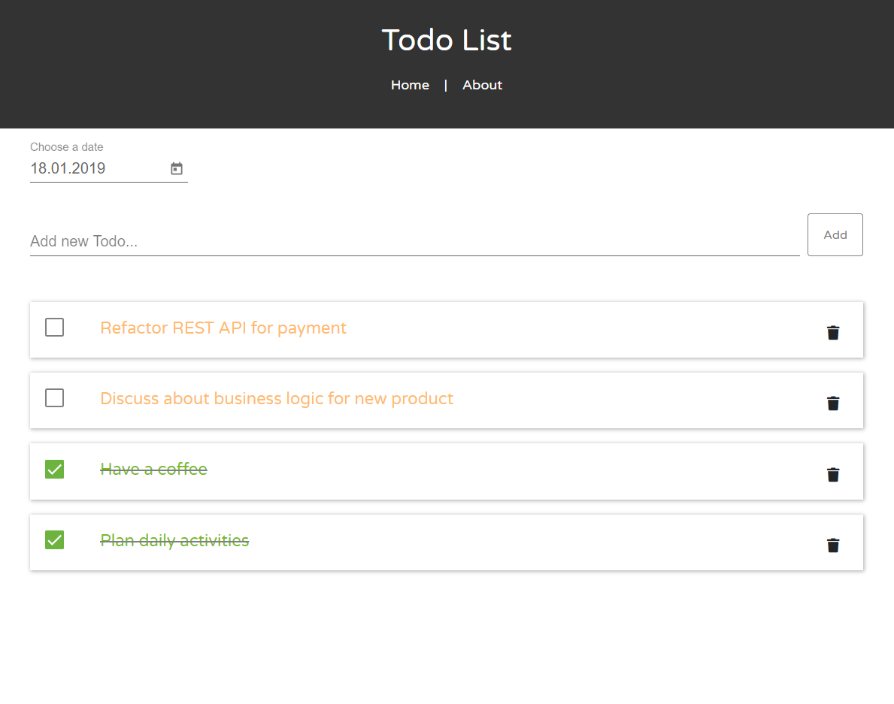
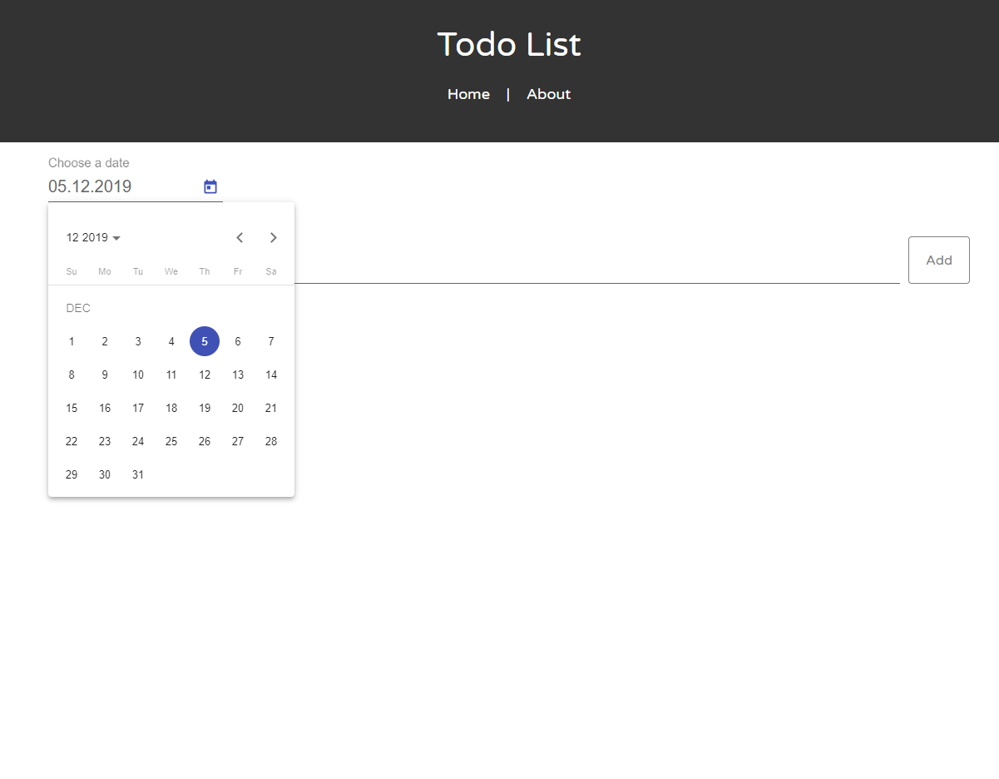
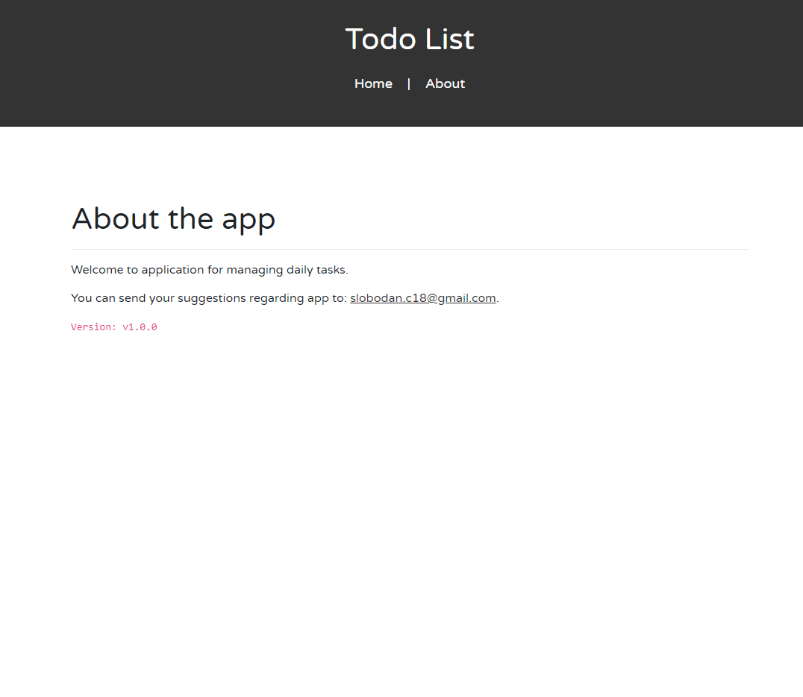

# Todo Application

TODO application is used for daily task management. It enables users to add, delete and complete TODO items.

## Screenshots
 
 
 

## Getting Started

These instructions will get you a copy of the project up and running on your local machine for development and testing purposes.

### Prerequisites

- Java Development Kit [https://www.oracle.com/technetwork/java/javase/downloads/jdk8-downloads-2133151.html]
- Java IDE, preferably Eclipse Java EE IDE for Web Developers [https://www.eclipse.org/downloads/]
- MySQL Database Server [https://netbeans.org/kb/docs/ide/install-and-configure-mysql-server.html]
- MySQL Workbench for database access (not mandatory) [https://dev.mysql.com/downloads/workbench/]
- Node.js [https://nodejs.org/en/]
- Text editor, preferably Visual Studio Code [https://code.visualstudio.com/Download]

### Installing Backend

1. Import 'todoapp-backend' in Java IDE (File->Import->General->Existing Projects into Workspace)
2. Run the application as Spring Boot App
3. Test if REST APIs are successfully exposed (using Postman, Mozilla RESTClient, or some other tool)
Notes:
- List of available endpoints can be seen in controllers (src\main\java\com\scvetkovic\todoapp\web\controller)
- Four todo items are provided as test data
- After restarting server, database will be again in initial state (in order to change this see 'spring.jpa.hibernate.ddl-auto' in application.properties)
 
### Installing Frontend

1. Open project 'todoapp-frontend' in some text editor, preferably Visual Studio Code
2. Install dependencies. Make sure you have nodejs installed in your system ($ npm install)
3. Run the project ($ ng serve)
4. Application should be available at http://localhost:4200/

## Built With

* [Spring Boot](https://spring.io/projects/spring-boot/) - The web framework used for exposing APIs
* [Maven](https://maven.apache.org/) - Dependency Management
* [Angular 8](https://angular.io) - Used for building user interfaces

## Authors

[Slobodan Cvetkovic](https://github.com/slobodanc93)

